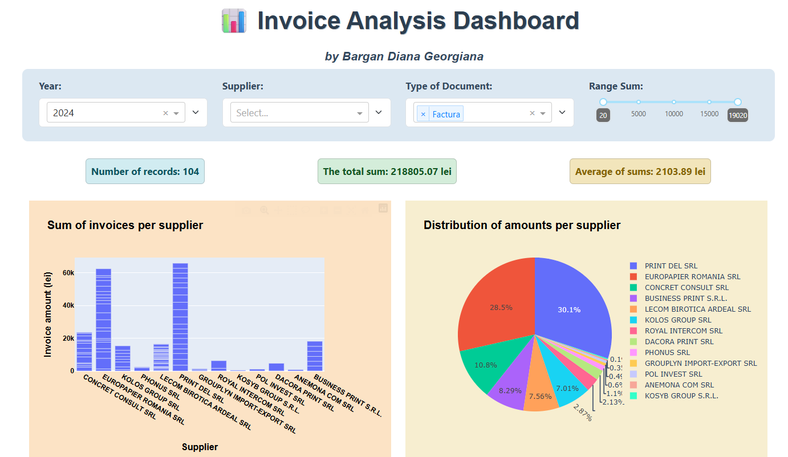
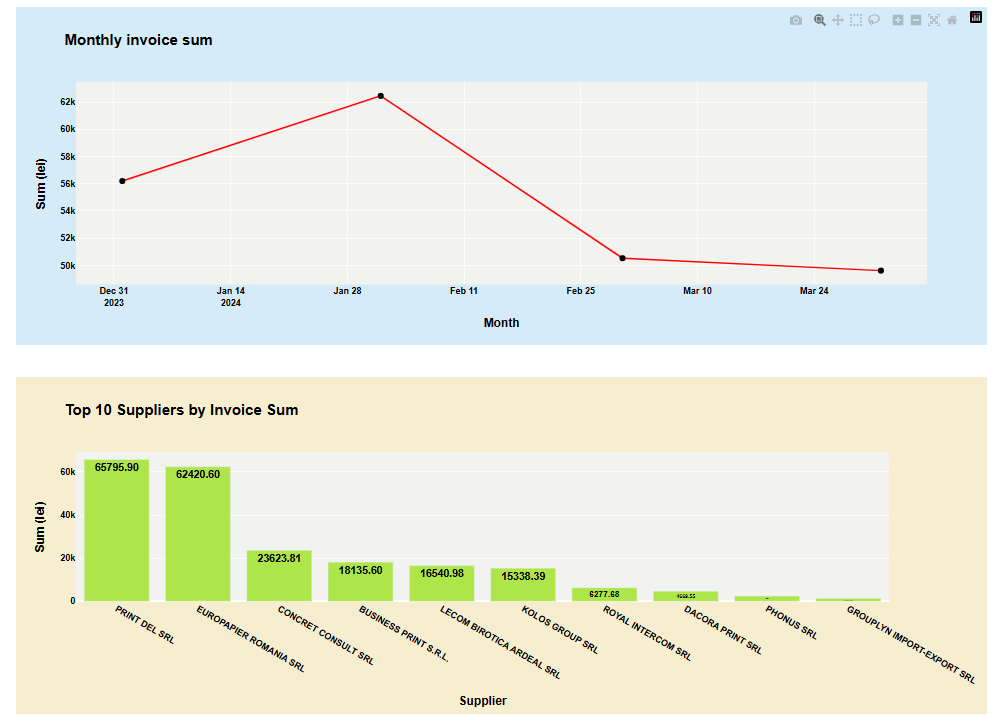
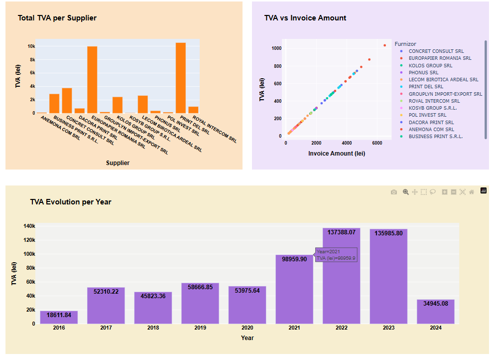
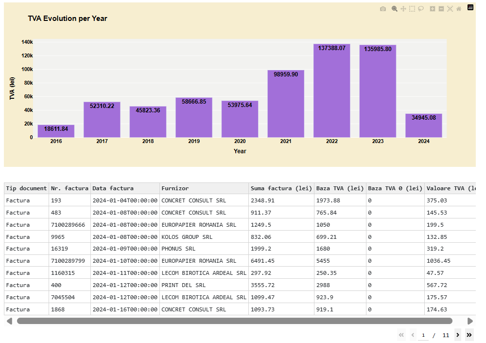

# Project-Python-Invoice-Analysis-Dashboard
**Description application:**  
Invoice Analysis Dashboard is an application written in Python using libraries such as Dash, Plotly, and Pandas, for visualizing and analyzing a company's invoices.    
The application allows for quick exploration of financial data, identification of major suppliers, monitoring of invoice amounts and VAT, and highlighting months with high financial impact.  
**Description application:** 
**Dashboard:**
   

  
  

