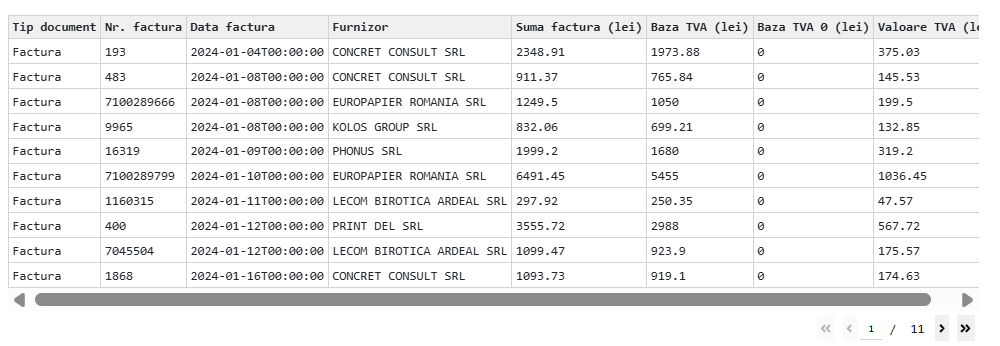

# Project-Python-Invoice-Analysis-Dashboard
**Description application:**    
  * Invoice Analysis Dashboard is an application written in Python using libraries such as Dash, Plotly, and Pandas, for visualizing and analyzing a company's invoices.      
  * The application allows for quick exploration of financial data, identification of major suppliers, monitoring of invoice amounts and VAT, and highlighting months with high financial impact.
     
📌 **Main functionalities:**   
  * Filtering invoices by year, supplier, document type, and amount range.
  * Viewing invoice amounts per supplier, their distribution, and monthly evolution.
  * Identifying Top 10 suppliers by invoice value.  
  * VAT analysis: total per supplier and annual evolution across all years.  
  * Interactive table displaying all filtered invoices.

💡 **Practical benefits:**     
  * Provides a clear overview of financial flows.  
  * Enables identification of strategic suppliers and critical periods.  
  * Helps monitor and control invoice amounts and VAT.  
  * Supports fast and effective decision-making in accounting and management.  

📊 **Dashboard overview**
   

  
  

